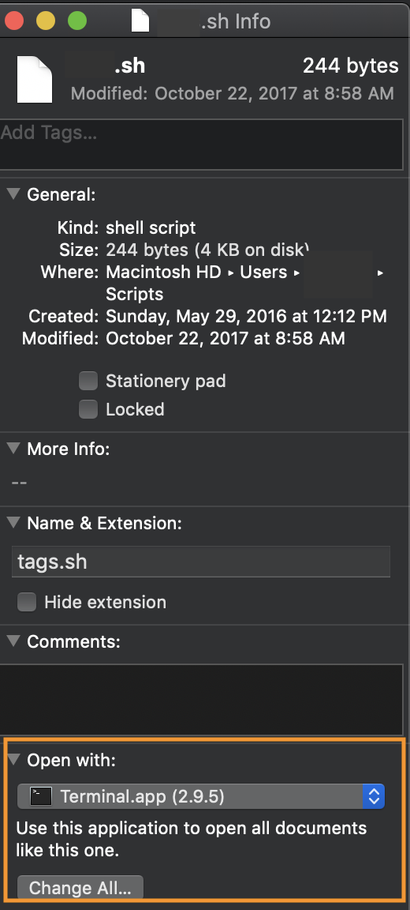

[Next &gt;&gt;](journal-script.md)

# Your first shell script

The terminal window that you've been using to talk directly to your computer's operating system is sometimes called a *shell*.

In this class, we're using a particular shell known as the *Bourne Again Shell*, or *Bash* for short.

A *shell script* is bit of code that can run in this shell. Instead of typing the code at the command line every time you want to use it, though, you can save this bit of code in a file. Once you've saved it in a file, one way you can make it run in the shell is to simply double-click it in your GUI, just as you would a file that you want to open. Clicking on a shell-script file doesn't simply open it, though; it runs the script, carrying out a task.

## Set-up

Before we write our shell script, let's create a new folder inside `/Users/yourusername` and call it `scripts`. It's nice to have a dedicated folder for any scripts you write. 

Open a terminal window, and at the prompt (`$`) type this:

`mkdir scripts`

Hit `Enter` (or `return`). This should land you back at the prompt. Now type

`code scripts`

Again, hit `Enter/return`. This should open up VS Code if it isn't already open, and show your new folder in the "Explorer" in the left navigation pane of your window.


If `code scripts` failed to open VS Code for you, you probably omitted to add `code` to `PATH` as instructed during your installation of VS Code. No problem. Revisit the instructions [here](https://github.com/WhatTheDickens/install/blob/master/sections/vscode.md#osx) and make the changes now.

Use `File > New File` from the VS Code menu or the `New File` icon that appears when you mouse over the folder name to create a new file inside your `scripts` folder. Name the file `hello.sh`.

You'll recall that the `.md` extension tells VS Code to interpret your plain text file as markdown, and that the `.html` extension tells it to interpret your plain text as html markup intended for display in a browser. The `.sh` extension lets VS Code (and your computer's operating system) know that you're writing a shell script.

Type the following into `hello.sh` *exactly* as you see it here, then save the file. We really do mean *exactly*. If you get anything wrong, your script won't run. (Sure, you could just copy-paste, but it's really worthwhile to give typing it a try. It will help you pay closer attention to what's in the file.)

```
#!/bin/bash

mkdir ~/hello
cd ~/hello
echo "Hello World!" > hello_world.txt
code hello_world.txt
```

Save the file.


## Deep breath

Let's take a second to understand what we're doing here.

The first line, `#!/bin/bash`, is like a hand-wave to your operating system, saying "Hey, look at me, I'm a bash script!"

The next line, `mkdir ~/hello` tells your computer to create a directory (i.e., folder) named `hello` in your home folder. (`~/` is just useful shorthand for `/Users/yourusername` where `yourusername` is your actual username.)

The line after that says, "Switch to the folder `~/hello`."

The one after that says, "Print the text string 'Hello World!' and write it to a new file inside the current directory, naming that file `hello_world.txt`"

The final line says, "Open the file `~/hello/hello_world.txt` in VS Code."

Each of these lines is its own command. When the script runs, the commands will be executed in sequence: (1) Make a new directory (2) Move into the new directory, (3) Print a string of text and write it to a new file, (4) Open the new file in VS Code.

We're almost ready to run this script. Just one more step.

## Make sure your script file is executable

In order to run, the file containing must be executable. Let's see if we need to do that. Open a terminal window and `cd ` to your `scripts` folder by typing `cd scripts` at the prompt (`$`) and hitting `Enter/return`. (If you get a message that there's no such file or directory, try `cd ~/scripts`. If that doesn't work, double-check to make sure your scripts folder is in your home directory and not, for example, inside `Documents` or `Desktop`. If necessary, use the GUI to move `scripts` into your home folder.)

Type `ls -l` at the prompt and hit `Enter/return`. You should get a response that looks something like this:

`-rwxr--r--@ 1 yourusername  staff   167 Feb  8 12:00 hello.sh`

What you're looking for is that `x` near the beginning of the string, after the `rw`. The full string tells you who has permission to do what with the file. The string above is telling us that the computer's adminisrator (i.e., you) can *read, write, and execute* the file (`rwx`), a group named "staff" can *read* but not *write* or *execute* it (`r--`), and a third group (everyone else) has the same permissions as "staff" (`r--`).

If the first combination of letters you see is `rwx`, you're good to go. If not, we need to change the file's permissions. You can do that by typing the following at the prompt

`chmod +x hello.sh`

Hit `Enter/return`. Type `ls -l` and hit `Enter/return` again to confirm that you've given yourself permission to execute the script. 

## Let's do this

Use the `pwd` command to confirm that you're in your `scripts` directory. Now type the following at the prompt:

`./hello.sh`

Hit `Enter/return`. What do you see?

## Running your script from the GUI

If you're a Windows user, you should now be able to go to `/Users/yourusername/scripts` (aka `~/scripts`) in your GUI and double-click the `hello.sh` icon to make the script run.

If you're a Mac user, your computer will likely just open `hello.sh` for you to edit rather than running the script. If it does, you'll need to tell your Mac to treat your `.sh` file as executable code rather than a file you want to open and read. To do that, click once on `hello.sh`, go to File > Get Info (or simply type `command-I`), and use the dropdown near the bottom of the Info box to select `Terminal.app` as the application that should be used to open the file. 

The procedure is similar in Windows if you need to make the equivalent change there.



[Next &gt;&gt;](journal-script.md)