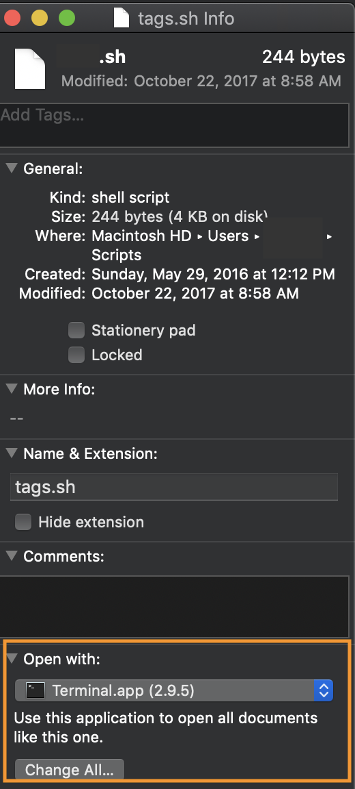

# A shell script for creating journal files

Right now, every time you want to add to your markdown journal, you need to do the following:

- Open VS Code
- Open a new file and give it with the name `journal_yyyy-mm-dd.md` where `yyyy-mm-dd` represents that day's actual date
- Save it to `/Users/yourusername/Documents/journal` on your computer's hard drive, where `yourusername` is your actual username

That's kind of a pain. What if we could automate this process by writing a couple of lines of executable code?

Now that you know a little bit about using your computer's command line, you can do this quite easily.

## Shell scripts

The terminal window that you've been using to talk directly to your computer's operating system is sometimes called a *shell*.

In this class, we're using a particular shell known as the *Bourne Again Shell*, or *Bash* for short.

A *shell script* is bit of code that can run in this shell. Instead of typing the code at the command line every time you want to use it, though, you can save this bit of code in a file. Once you've saved it in a file, one way you can make it run in the shell is to simply double-click it in your GUI, just as you would a file that you want to open. Clicking on a shell-script file doesn't simply open it, though; it runs the script, carrying out a task.

## Set-up

Before we write our shell script, let's create a new folder inside `/Users/yourusername` and call it `scripts`. It's nice to have a dedicated folder for any scripts you write. 

Now fire up VS Code, open a new file, and, before going any further, save the file to your new `scripts` folder with the name `journal.sh`.

You'll recall that the `.md` extension tells VS Code to interpret your plain text file as markdown, and that the `.html` extension tells it to interpret your plain text as html markup intended for display in a browser. The `.sh` extension lets VS Code (and your computer's operating system) know that you're writing a shell script. 

Copy-paste the following into your `journal.sh` file.

```
#!/bin/bash

touch ~/Documents/journal/journal_$( date '+%Y-%m-%d_%H-%M' ).md
code ~/Documents/journal/journal_$( date '+%Y-%m-%d_%H-%M' ).md
```
Save the file.

Let's take a second to understand what we're looking at here.

The first line, `#!/bin/bash`, is like a hand-wave to your operating system, saying "Hey, look at me, I'm a bash script!"

The second line, beginning with `touch`, tells your computer to create a file whose name begins `journal_` and ends with the current year (`%Y`), month (`%m`), day (`%d`), hour (`%H`), and minute (`%M`), followed by the `.md` extension. The file is to be created in your `journal` folder, which is inside `Documents`.

(As long as we're automating, why not add the precise time, down to the hour and minute? This way if we accidentally run the script twice in one day, our new file won't overwrite our old one.)

The second line, beginning with `code`, tells your computer to open the file that the first line just created.

You may be wondering about the `~/` in the file path contained in each line of code. It's just a useful shorthand for `/Users/yourusername`. 

## Make your script executable

If you're a Windows user, you should now be able to go to `/Users/yourusername/scripts` (aka `~/scripts`) and double-click `journal.sh` to make the code run. If it runs successfully, you'll see a new, empty file open up in VS Code with the correct file name.

If you're a Mac user, you may have to take a couple of additional steps.

### Mac user step one

You may need to tell your Mac to treat your `.sh` file as executable code rather than a file you want to open and read. To do that, click once on `journal.sh`, go to File > Get Info (or simply type `command-I`), and use the dropdown near the bottom of the Info box to select `Terminal.app` as the application that should be used to open the file.



### Mac user step two

You may need to alter the file's permissions in order to run it. To do this, open a terminal window and navigate to `~/scripts/`.

If you type `ls` at the command prompt (`$`), you should see your `journal.sh` file listed. If you don't, check that you're indeed inside `~/scripts` and that that's where `journal.sh` actually lives. If you accidentally saved the file somewhere else, now's the time to drag it where it belongs!

Now copy-paste this at the prompt:

```
chmod 700 journal.sh
```
Hit `Enter` (aka, on some keyboards, `return`). You're done!

Now go back to `journal.sh` in the GUI and double-click it. If everything's working right, you should end up with a new, empty file in VS Code with the current date and time in the file name.


