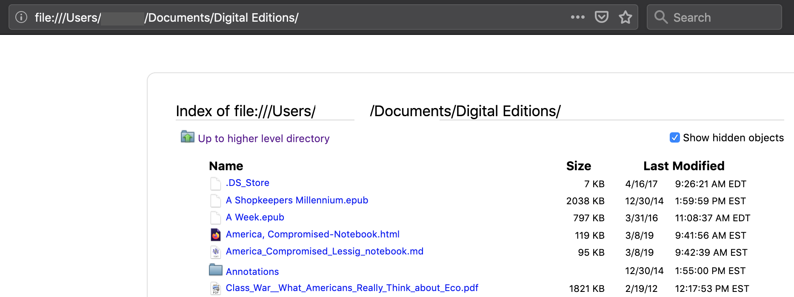

# Navigating your filesystem

Most of the time, we navigate the filesystem on our computers through the Graphical User Interface or GUI. MacOS calls this the "Finder." Windows calls it the "File Explorer."

This is a perfectly good way to navigate files, though later on, when we begin working with our computers through a terminal window, we'll have to use a different way.

A few adjustments to your GUI may help make navigating via the terminal seem more logical when we get to that point.

## Windows

You'll want to make some adjustments to your File Explorer in Windows. To make them, open the pane that reveals File Explorer preferences by using the caret icon at the upper-right corner of an Explorer window (1), then click on the "View" tab (2). Selecting the "List" view of your files (3) will highlight the hierarchical structure of your filesystem, making the relationships between folders and files in your filesystem more transparent. Checking the File name extensions box (4) will reveal the extensions at the ends of your filenames (e.g., .png, .docx, .pdf, .jpg). (The box is not checked in the image below. You should check it.) 

## MacOS

To show filename extensions in MacOS, go to Finder > Preferences > Advanced and check the box next to "Show all filename extensions."

To display your files as a list, you have two options. You can select the View > as List from the Finder. But you may find that another option makes your file hierarchy even more transparent: View > as Columns. The "column" view shows the folders and files inside an enclosing folder in the next column to the right.

On your Mac, you'll also find it helpful to make sure that the following, at least, are visible in the Sidebar: Desktop, Documents, Downloads, —'s Computer, and your home folder (home icon).

## Navigating through your browser

You can navigate your filesystem through a browser, such as Firefox or Safari. This is a good way to get a sense of the system's hierarchical organization. Once you understand how to navigate your files and folders this way, you also have a useful tool for quickly accessing plain text files and testing files you've written in HTML.

To navigate your filesystem in a browser window, go to the browser's location bar (where you usually see a web address that begins `http://` or `https://`). The `http` in a web address stands for *hyptertext transfer protocol*. Typing that into your browser location bar tells your browser to go to a location on the web.

Instead of typing `http://` or `https://`, however, type `file://`. You're now telling your browser that you want to go to a location in your filesystem rather than a location on the web. 

How do you get to a particular location in your filesystem? Simply type the path to that location in your file hierarchy, beginning with `/Users` (on a Mac) or `/C:/Users` (in Windows). *Note that this results in 3 forward slashes (`///`) following `file:`*. Keep in mind that the first two are part of the protocol (`file://`) and the third is actually part of the file path (`/Users/...` or `/C:/Users/...`).

To navigate to your Documents folder, type `file:///Users/your_username/Documents/` (Mac) or `file:///C:/Users/your_username/Documents/` (Windows). Hit `Return` or `Enter`, and your browser will take you to your Documents folder, showing you the folders and files that live inside it.

(In place of `your_username` type your actual username on the computer you're using.)

In the Mac example below, the username has been obscured.

If there's a plain text (e.g., `.md`, `.txt`) file in there, or a `.html` file, or a `.pdf` file, or an image file (e.g., `.jpg`, `.png`) it will open right in your browser window.

When you browse your filesystem this way, you may also see files and folders that are hidden from you when browsing via your GUI. Their names begin with a `.`, e.g., `.DS_Store`. These files and folders are normally hidden from users for a reason: altering them in any way can seriously affect your computer's functioning. Best to leave them alone unless you're absolutely sure you know what you're doing.

[&lt;&lt; Previous](../README.md) | [Next &gt;&gt;](markdown.md)