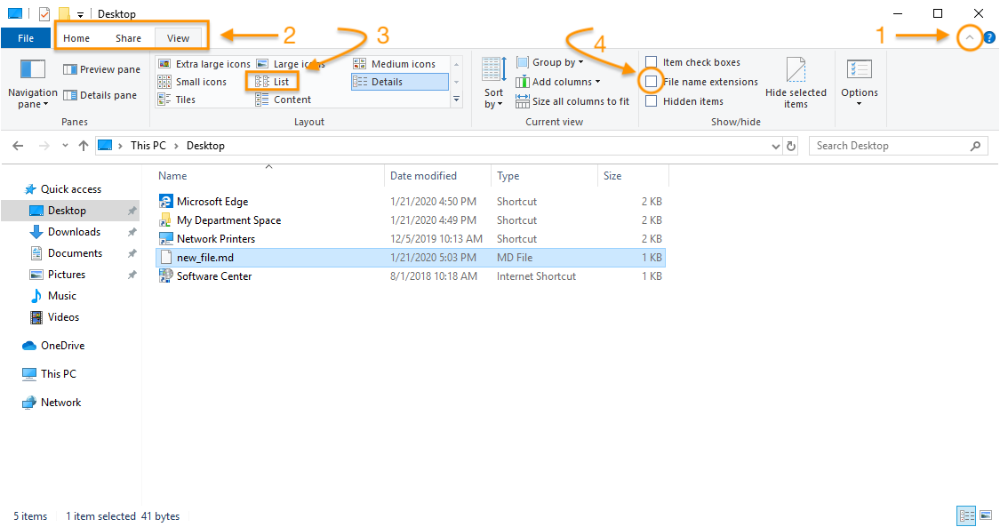
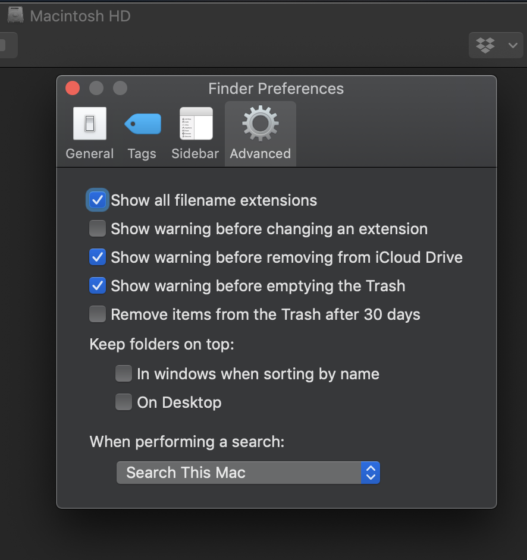
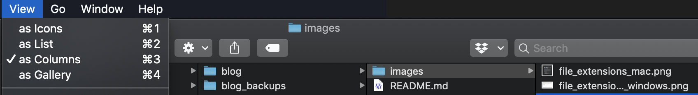
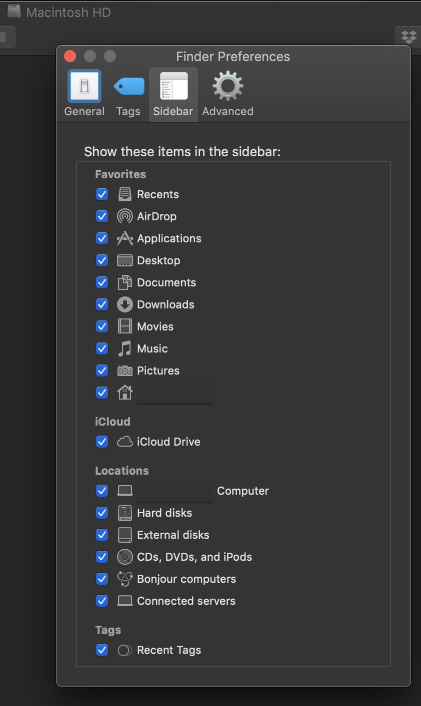

# Navigating your filesystem

Most of the time, we navigate the filesystem on our computers through the Graphical User Interface or GUI. MacOS calls this the "Finder." Windows calls it the "File Explorer."

This is a perfectly good way to navigate files, though later on, when we begin working with our computers through a terminal window, we'll have to use a different way.

A few adjustments to your GUI may help make navigating via the terminal seem more logical when we get to that point.

## Windows

You'll want to make some adjustments to your File Explorer in Windows. To make them, open the pane that reveals File Explorer preferences by using the caret icon at the upper-right corner of an Explorer window (1), then click on the "View" tab (2). Selecting the "List" view of your files (3) will highlight the hierarchical structure of your filesystem, making the relationships between folders and files in your filesystem more transparent. Checking the File name extensions box (4) will reveal the extensions at the ends of your filenames (e.g., .png, .docx, .pdf, .jpg). (The box is not checked in the image below. You should check it.) 

## MacOS

To show filename extensions in MacOS, go to Finder > Preferences > Advanced and check the box next to "Show all filename extensions."

To see display your files as a list, you have two options. You can select the View > as List from the Finder. But you may find that another option makes your file hierarchy even more transparent: View > as Columns. The "column" view shows the folders and files inside an enclosing folder in the next column to the right.

On your Mac, you'll also find it helpful to make sure that the following, at least are visible in the Sidebar: Desktop, Documents, Downloads, —'s Computer, and your home folder (home icon).

Next &gt; &gt;

