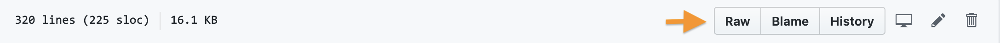

# Creating your first markdown file

## Create a project folder

In your home folder or your Documents folder, create a folder named `projects`.

## Write to a new file

Launch VSCode and type the following *exactly* as you see it here.

```
# 27 January 2020

Wow! This is my *very first* markdown file!

I'm impressed with myself for **these reasons**:

- I've learned something new
- I'm on my to becoming a [digital humanist](https://en.wikipedia.org/wiki/Digital_humanities)
```

## Save the file

Save the file, naming it whatever you like, but making sure to add the `.md` extension to the end of the filename.

How did that change the file contents' appearance in VSCode?

## Add an image to your file

- Inside your `projects` folder create another folder named `images`
- Click the link in your markdown file to the Wikipedia page on "Digital Humanities"
- Click on the screengrab of textual analysis of Austen's *Pride and Prejudice* in the upper right of the page
- Click the "More details button" in the next window
- Click the "Download" button to the right of the image in the page named "File:Pride and Prejudice in Voyant Tools.png"
- Download the "Full resolution" version of the image and move it to the `images` folder in your `projects` folder
- In your markdown file, type ``

What have you just done? To find out, click the "Open Preview to the Side" button in VSCode. It looks like this: 


## Explore the files in this module

Scroll up to the top of this page and click on the button that says "Raw". Do the same on the page for the syllabus. What do you see?



## Question

Why `../images/` and not `images/` ?

