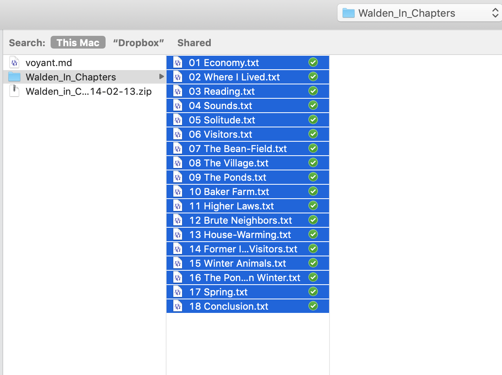

# Viewing *Walden* in Voyant

## Stream the plain text copy of _Walden_ from gutenberg.org

`$ curl https://www.gutenberg.org/files/205/205-0.txt`

## Make a local copy of the file

First make a directory for this project. You can create in the GUI or from your terminal. In the example below, it's in `~/Documents/projects` but you can put it anywhere you like. Just be sure you know where it is so you can go to it in your terminal. 

```
$ cd ~/Documents/projects
$ mkdir walden
$ cd walden
$ curl https://www.gutenberg.org/files/205/205-0.txt > walden.txt
```

## Open your plain text file in VS Code

`$ code walden.txt`

This file contains both _Walden_ and _On the Duty of Civil Disobedience_. It also contains gutenberg.org's standard licensing information at the end. We want only the text of _Walden_, so we need to

1. Delete everything above the title of the first chapter, "Economy" (including the all-caps title "WALDEN"). To do this, put your cursor to the left of the "E" in "Economy" and press `cmd-shift-uparrow` (Mac) or `ctrl-shift-home` (Windows), then hit `delete`.
2. Delete everything after the end of _Walden_. To do this, search for the words "THE END," which conclude _Walden_. Put your cursor in front of "THE" so you'll delete "THE END" and everything below it. Press `cmd-shift-downarrow` (Mac) or `ctrl-shift-end` (Windows)to make your selection, then hit `delete`.
3. Save the file.

## Upload _Walden_ to Voyant

Go to [https://voyant-tools.org/](https://voyant-tools.org/), press "Upload," navigate to `walden.txt` on your hard drive, and upload.

What's there? What questions could this information help us answer?

## Comparing across chapters of _Walden_

If you upload the chapters of _Walden_ as separate files, you can make comparisons across the chapters. Let's do that.

Download the folder `Walden_in_Chapters` from our shared Drive folder. Put it in your `walden` folder.

Return to [https://voyant-tools.org/](https://voyant-tools.org/) and upload again, this time navigating to the folder `Walden_in_Chapters` and _selecting all 18 chapters of _Walden_.

